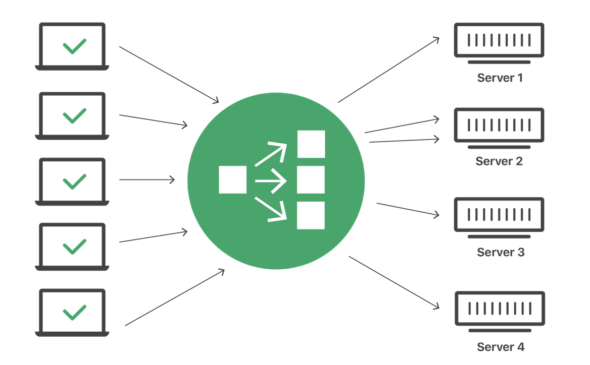
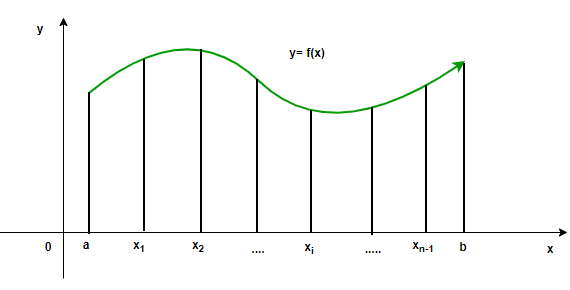

# Distributed Systems Group Project

## Group 1: Load balancer to MPI based service

### Group Members

| No | Student ID | Name            | GitHub id | Role |
|----|------------|-----------------|-----------|------|
| 1  | BI12-243 | Le Vu Hoang Linh | r4m0D | Team Leader, Developer - Trapezoidal Algorithm Implementation |
| 2  | BI12-416 | Do Nhat Thanh | f1sh33 | Consultant, Presentation Specialist |
| 3  | BI12-467 | Tran Duc Tuan | cs8u7 | Developer - Load Balancer Implementation |
| 4  | BI12-368 | Vu Ngoc Minh Quan | vnkunnq | Developer - Docker Configuration |
| 5  | BI12-325 | Nguyen Duc Nguyen | ducnguyen2410 | Report Writer - Theoretical Foundations |
| 6  | BI12-468 | Tran Nguyen Kien Tuan | Tuso-shadoq | Report Writer - Project Documentation |

## Theoretical Foundations
### MPI (Message Passing Interface)
MPI stands for Message Passing Interface, a standard communication protocol for parallel programming across distributed computing systems. It enables programs to exchange data between different processes, each potentially running on a separate computer node.

MPI is used to develop high-performance applications in multi-processing or multi-node environments. It offers a range of functions for sending and receiving messages, managing complex data, and optimizing resource allocation.

MPI helps tackle computationally intensive scientific and engineering problems like large data analysis. It supports effective workload division and result synthesis, significantly reducing processing time for complex tasks.
It's much simpler than that.


### Load Balancer
A load balancer is a device or software that distributes workloads across multiple servers or resources. It aims to optimize resource use, enhance reliability, and increase system resilience.

Load balancers are essential in large network systems and web applications to ensure no single server becomes overwhelmed. They distribute user requests across multiple servers, ensuring each operates within its capacity limits, thus speeding up response times and minimizing downtime.


### Trapezoidal Rule (Numerical Method)
In numerical methods, the Trapezoidal Rule is a technique for approximating the area under a curve of a function, used in definite integral calculations. It operates by dividing the area under the curve into a finite number of trapezoids and summing their areas.

The trapezoidal rule is a tool primarily used in mathematical and engineering fields for numerical integration, its principles can be creatively applied to enhance system analysis and decision-making in distributed computing environments, such as those involving MPI and load balancers.

## Implementation Details

## Build and Deployment Guide

**Dependencies:** Docker, Docker Compose

### Steps:
1. Clone the repository
2. Run the following command to build the docker images and start the services:
```bash
docker-compose up --build
```
**Note:** If you encounter the error `failed to solve: python:3.8-slim: error getting credentials - err: exit status 1, out: `, try manually pulling the base image with docker pull python:3.8-slim.


