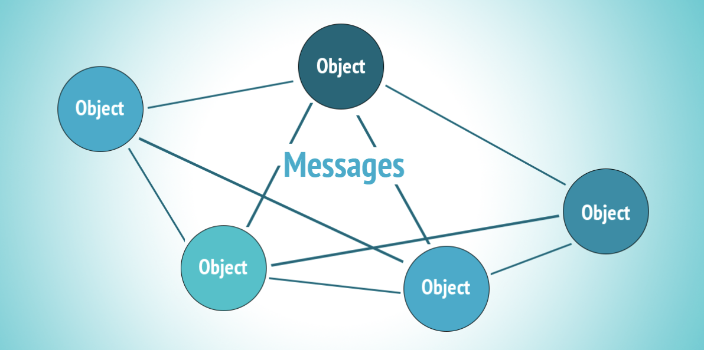

# Distributed Systems Group Project

## Group 1: Load balancer to MPI based service

### Group Members

| No | Student ID | Name            | GitHub id | Role |
|----|------------|-----------------|-----------|------|
| 1  | BI12-243 | Le Vu Hoang Linh | r4m0D | Team Leader, Developer, Report Writer |
| 2  | BI12-416 | Do Nhat Thanh | f1sh33 | Consultant, Presentation |
| 3  | BI12-467 | Tran Duc Tuan | cs8u7 | Developer |
| 4  | BI12-368 | Vu Ngoc Minh Quan | vnkunnq | Developer |
| 5  | BI12-325 | Nguyen Duc Nguyen | ducnguyen2410 | Report Writer |
| 6  | BI12-468 | Tran Nguyen Kien Tuan | Tuso-shadoq | Report Writer |

## Theoretical Foundations

### MPI (Message Passing Interface)
MPI stands for Message Passing Interface, a standard communication protocol for parallel programming across distributed computing systems. It enables programs to exchange data between different processes, each potentially running on a separate computer node.

MPI is used to develop high-performance applications in multi-processing or multi-node environments. It offers a range of functions for sending and receiving messages, managing complex data, and optimizing resource allocation.

MPI helps tackle computationally intensive scientific and engineering problems like large data analysis. It supports effective workload division and result synthesis, significantly reducing processing time for complex tasks.
It's much simpler than that.



### Load Balancer
A load balancer is a device or software that distributes workloads across multiple servers or resources. It aims to optimize resource use, enhance reliability, and increase system resilience.

Load balancers are essential in large network systems and web applications to ensure no single server becomes overwhelmed. They distribute user requests across multiple servers, ensuring each operates within its capacity limits, thus speeding up response times and minimizing downtime.


### Trapezoidal Rule (Numerical Method)
In numerical methods, the Trapezoidal Rule is a technique for approximating the area under a curve of a function, used in definite integral calculations. It operates by dividing the area under the curve into a finite number of trapezoids and summing their areas.

The trapezoidal rule is a tool primarily used in mathematical and engineering fields for numerical integration, its principles can be creatively applied to enhance system analysis and decision-making in distributed computing environments, such as those involving MPI and load balancers.


## Scenario

In the project, a load balancer is implemented within an MPI-based system, where a main node coordinates with worker nodes connected in a network. The main task involves numerically calculating the integral of the function f(x)=x2f(x)=x2 using the trapezoidal rule. The main node's role is to divide the task and distribute the corresponding intervals to the worker nodes. Each worker node receives its segment of the integral, performs the calculation, and then sends the computed results back to the main node. The main node aggregates these results from all worker nodes and displays the final result, effectively managing the distribution and aggregation of the computational workload across the network.

## Architecture

## Implementation

## Build and Deployment Guide

**Prerequisites:**

Ensure you have the following software installed:
- Docker: Required for creating containerized environments.
- Docker Compose: Used for running multi-container Docker applications.

### Deployment Steps:
1. Clone the repository:

Start by cloning the project repository to your local machine using the appropriate Git command for your repository URL.
```bash
git clone https://github.com/r4m0D/DistributedSystemsG1-MPI.git
``` 
2. Build and deploy the containers:

Run the following command to build the Docker images and start the services. This will create a network of 5 containers comprising 1 master and 4 slaves, where the master will manage connections to the slaves.
```bash
docker-compose up --build
```
**Troubleshooting:**
- If you encounter the permission error, run the command with `sudo`:
```bash
sudo docker-compose up --build
```
- If you encounter the error `ERROR [mpi-master internal] load metadata for docker.io/library/python:3.8-slim-buster`, try pulling the image manually with:
```bash
docker pull python:3.8-slim-buster
```
After pulling the image, re-run the `docker-compose up --build command`.

3. Run the MPI program:

After the services have started, prepare the MPI environment by setting the appropriate permissions for the script with the following command:
```bash
sudo chmod +x start.sh
```
Then, execute the MPI program using:
```bash
./start.sh
```
**Configuration:** Modify the `-N` flag value in the `start.sh` file to change the number of processes running on each slave machine, allowing you to simulate different scales of the distributed system.

## Conclusion

This guide provides a straightforward process for setting up and running a distributed system with Docker containers. For more detailed configuration changes or troubleshooting, refer to the Docker and Docker Compose documentation.